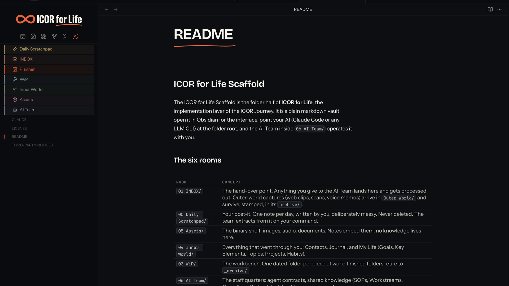

# ICOR for Life - INKLINE

An Obsidian theme with two rooms: an ink room (dark) and a paper room
(light). One marker orange, drawn hairlines, and a teacher's handwriting
in the margin.

Most themes add color; INKLINE takes it away. Almost everything on the
page is ink on paper, one orange is reserved for the few places that need
your attention, and your highlights and comments render the way they
would in a well-marked book: marker wash and handwriting. The result is a
vault that reads like pages, not like an interface.



**Beta release.** This theme works and is in daily use in a real vault,
but you will find rough edges. If something looks off, open an issue on
this repo and it gets fixed fast.

## What you get

- **Two full modes.** Ink (dark) and Paper (light), designed as one system,
  not an inversion. Both are derived from the myICOR application design
  tokens; every color in both modes rides the same token grammar.
- **The handwritten layer.** Blockquotes, `[!note]` / `[!tip]` / `[!quote]`
  callouts and `%%comments%%` render in a handwriting face, like a teacher
  writing in your margin. `==highlights==` are one marker wash, no glow.
- **Mermaid diagrams in ink.** Flowcharts and sequence diagrams are styled
  as part of the system: your reading typeface inside the nodes, drawn
  strokes, edge labels and arrowheads in theme colors, and correct color
  in dark mode. Obsidian's core dark mode renders mermaid by inverting the
  whole SVG, which turns a careful diagram into a photo negative; INKLINE
  switches that off and colors the diagram properly in both rooms.
- **Embedded fonts, zero requests.** Four typefaces ship inside the CSS as
  base64 woff2, each under the SIL Open Font License 1.1 and named in
  `THIRD-PARTY-NOTICES.md`. The theme makes no network requests at all.
- **A token grammar for plugins.** Every `--ink-*` token falls back to
  Obsidian defaults, and first-party ICOR plugins style themselves with the
  same tokens, so their dashboards match the theme in both modes.
- **Room icons for numbered folders.** A root folder whose name starts `00 `
  through `06 ` loses the number in the sidebar and gains an inked icon in its
  own hue. Built for the ICOR for Life vault, harmless anywhere else: a vault
  without those folders matches nothing and looks untouched.
- **A banner over the folder tree**, which links to myicor.com when the
  myICOR Connect plugin is installed.

## Settings

Everything above is on out of the box. To change any of it, install the
[Style Settings](https://obsidian.md/plugins?id=obsidian-style-settings)
community plugin; the theme then appears under Settings, Style Settings with
five switches. The plugin is optional and the theme is complete without it.

| Switch | Default | What it does |
| --- | --- | --- |
| Turn off the handwritten layer | off | Blockquotes, note/tip/quote callouts and `%%comments%%` render in the body face instead of handwriting. |
| Hide the ICOR for Life banner | off | Removes the banner above the folder tree. |
| Turn off room icons and colors | off | Root folders named `00` to `06` keep their prefixes and Obsidian's default folder look. |
| Reduce Obsidian's own controls | off | Hides the vault-switcher row, and New note, New folder and Change sort order from the file-tree toolbar. |
| Hide the left ribbon | off | Hides Obsidian's thin left ribbon. |

The last two are off because they take a control away from Obsidian, and a
theme should not do that to a vault it was just installed into. The ICOR for
Life Obsidian Edition ships them on, because there every one of those routes
exists somewhere else.

## Install

Requires Obsidian 1.5.0 or newer.

- **From Obsidian:** Settings, Appearance, Themes, Manage, search "myICOR
  INKLINE", install, use.
- **Manually:** copy `theme.css` and `manifest.json` from the latest
  release into `.obsidian/themes/ICOR for Life - INKLINE/`, then select the theme
  under Settings, Appearance.

## For plugin authors: the rooms contract

Room icons and colours are data-driven. The theme draws whatever four custom
properties and one attribute say, and applies its own ICOR defaults only to
folder rows nobody else has claimed:

| Set on `.nav-folder-title` | Meaning |
| --- | --- |
| `data-icor-kind="room"` | block, no arrow, prefix hidden, label from `--room-label` |
| `data-icor-kind="family"` | coloured name and a small glyph |
| `data-icor-kind="none"` | leave this row to Obsidian, even if it is a 00-06 room |
| `--room-color` | the colour in the ink room |
| `--room-color-paper` | optional; the colour in the paper room, falls back to `--room-color` |
| `--room-icon` | `url(...)` used as a mask |
| `--room-label` | optional; rooms only; the text shown in place of the real name |

Inline styles beat the theme's defaults by the ordinary cascade, so a plugin
that sets these on a row owns that row. Nothing needs `!important`. The
contract is measured in `test/rooms.test.mjs`. ICOR for Life - Interface is
the first-party plugin that writes it.

## Building

`theme.css` is generated. Edit the files under `src/` and run:

```
npm run build     # regenerate theme.css from src/
npm test          # fails if theme.css and src/ have drifted, then runs the gates
```

Each file under `src/` may declare `/* @guard <selector> */` on its first
line, and the build puts that guard on every selector in the file. So a
guarded file is written as plain CSS: nobody types the guard, nobody forgets
it on one rule, and nobody gets it half-right on another.

The gates run in a real engine rather than over the CSS text, because the
failure they exist to catch is a switch that moves and changes nothing.

## ICOR for Life Obsidian Edition

ICOR for Life - INKLINE is the visual system of the **ICOR for Life Obsidian
Edition**: ICOR (Input, Control, Output, Refine), the productivity
methodology by Paperless Movement / myICOR, implemented as a ready-to-use
Obsidian vault. The Edition's dashboards are built on INKLINE's tokens,
so the theme is not an accessory here; it is the layer the other parts
draw themselves with. Best to be used in combination with:

- **[ICOR for Life - Planner](https://obsidian.md/plugins?id=icor-for-life-planner)**, the weekly
  planning board: Todoist, ClickUp, starred email and Google Calendar
  synced into the vault, planned by drag and drop. Its cards, lanes and
  tray are styled with INKLINE tokens.
- **[ICOR for Life - Focus](https://obsidian.md/plugins?id=icor-for-life-focus)**, the gravity map
  of your vault: what you touched today sits close, older work ripples
  outward. Drawn with the same token grammar, in both rooms.
- **[ICOR for Life - Diagrams](https://obsidian.md/plugins?id=icor-for-life-diagrams)**, a
  fullscreen viewer with zoom and pan for the mermaid diagrams this theme
  styles, so a diagram keeps the ink look at every zoom level.
- **[ICOR for Life - Connect](https://obsidian.md/plugins?id=icor-for-life-connect)**, your
  app.myicor.com courses, progress and knowledge base inside the vault.
  Its dashboards ship with zero palette of their own and take every color
  from the theme.
- **[ICOR for Life - Chat](https://obsidian.md/plugins?id=icor-for-life-chat)**, your AI team
  in a tab beside your notes. Its cards, tool rows and decision blocks are
  drawn with this theme's tokens, and a shipped gate measures them against
  it in all four rooms.

The theme styles whatever you run it with, first-party or not: the tokens
fall back to Obsidian's defaults, so your own plugin choices keep working.

The complete, preconfigured experience (theme, all plugins, the seven-room
vault structure and the AI team) ships free as the **ICOR for Life**
vault: https://myicor.com. The method behind it is taught in the ICOR
Journey there.

## License

Creative Commons Attribution-NonCommercial-NoDerivatives 4.0 International
(CC BY-NC-ND 4.0); see [LICENSE](LICENSE). The embedded fonts remain under
their own SIL Open Font License 1.1, detailed in
[THIRD-PARTY-NOTICES.md](THIRD-PARTY-NOTICES.md). Free to install and use;
not for resale or re-publication.
